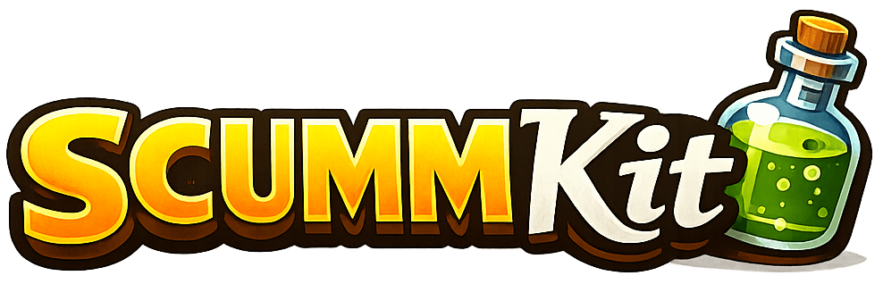

# SCUMMKit

[](https://github.com/jmnunezizu/scummkit/releases/latest)
[](https://github.com/jmnunezizu/scummkit/actions/workflows/ci.yml)
[](https://jmnunezizu.github.io/scummkit/)


[](LICENSE)

Cross-platform tools for building ScummVM-compatible Monkey Island Ultimate
Talkie Edition folders from legally owned Special Edition game files.

Point SCUMMKit at your local `Monkey1.pak` or `monkey2.pak`, choose an output
folder, and it extracts the classic resources, applies the talkie patches,
processes speech and sound assets, and writes a game directory you can add to
ScummVM.

SCUMMKit is designed for macOS, Linux, and Unix-like Windows environments such
as WSL or MSYS2. It uses Python plus common command line tools, and it does not
ship commercial game data or generated game output.

Supported games:

- [The Secret of Monkey Island: Special Edition](https://www.gog.com/en/game/the_secret_of_monkey_island_special_edition)
- [Monkey Island 2 Special Edition: LeChuck's Revenge](https://www.gog.com/en/game/monkey_island_2_special_edition_lechucks_revenge)

## What It Does

- Builds local ScummVM-compatible output folders for both supported games.
- Extracts classic SCUMM resources from Special Edition PAK files.
- Extracts and converts XACT wave bank (`.xwb`) speech, sound, music, and
  ambience assets.
- Packs ScummVM compressed speech archives such as `monkey.sog` and
  `monkey2.sog`.
- Injects high-quality SBL sound-effect resources for The Secret of Monkey
  Island.
- Converts music for The Secret of Monkey Island and supports `cd`, `hybrid`,
  and `se` root soundtrack modes.
- Provides SCUMM resource inspection and diagnostics commands.
- Python CLI: installed `scummkit` command and `python3 -m scummkit` from a
  source checkout.
- Automated pytest coverage for CLI parsing, archive packing, XWB parsing,
  SBL generation, and build diagnostics.

## What You Need

- A legally owned copy of one or both supported Special Edition games.
- Extracted game files, including the `.pak` file and matching `audio/`
  folder.
- Python 3.9 or newer.
- Common command line tools: `sox`, `ffmpeg`, `bspatch`, and `vgmstream-cli`.
- ScummVM to play the generated output folder.

You do not need the original Ultimate Talkie builder folder for normal builds.
SCUMMKit includes the minimal patch/table data with permission.

## Install / Setup

1. Install required runtime tools:

   macOS with Homebrew:

   ```bash
   brew install python sox ffmpeg vgmstream bsdiff
   ```

   Debian/Ubuntu:

   ```bash
   sudo apt install python3 python3-venv python3-pytest sox ffmpeg bsdiff clang
   ```

   Install `vgmstream-cli` from your package manager, upstream releases, or
   source if your distribution does not provide it.

   Windows users can run SCUMMKit from WSL, MSYS2, or another environment
   that provides Python, `bspatch`, `sox`, `ffmpeg`, and `vgmstream-cli` on
   `PATH`.

2. Install SCUMMKit:

   ```bash
   curl -fsSL https://github.com/jmnunezizu/scummkit/releases/latest/download/install.sh | sh
   ```

   The installer downloads the tagged release archive, installs it under
   `~/.local/share/scummkit`, creates a Python virtual environment, compiles
   `extractpak`, writes `~/.local/bin/scummkit`, and adds `~/.local/bin` to
   your shell startup file when it is not already on `PATH`.

3. Verify the SCUMMKit environment:

   ```bash
   scummkit --version
   scummkit doctor --out /tmp/scummkit-test
   ```

If your current shell cannot find `scummkit` immediately after installation,
run the export command printed by the installer or open a new shell.

### Installer Options

Run the installer again to reinstall or upgrade to the latest GitHub release.
The previous install directory is kept as `~/.local/share/scummkit.previous`.

Install a specific release:

```bash
curl -fsSL https://github.com/jmnunezizu/scummkit/releases/download/v0.3.0/install.sh | SCUMMKIT_VERSION=v0.3.0 sh
```

Install to custom user-local paths:

```bash
curl -fsSL https://github.com/jmnunezizu/scummkit/releases/latest/download/install.sh | \
  SCUMMKIT_HOME="$HOME/Tools/scummkit" SCUMMKIT_BIN_DIR="$HOME/bin" sh
```

Preview the install plan without changing files:

```bash
curl -fsSL https://github.com/jmnunezizu/scummkit/releases/latest/download/install.sh | sh -s -- --dry-run
```

### Uninstall

Remove the user-local install:

```bash
rm -rf ~/.local/share/scummkit ~/.local/share/scummkit.previous ~/.local/bin/scummkit
```

### Manual Source Install

Use this path when developing SCUMMKit or installing from a local checkout:

```bash
git clone https://github.com/jmnunezizu/scummkit.git
cd scummkit
clang extractpak.c -o extractpak
python3 -m scummkit doctor --out /tmp/scummkit-test
```

Run the test suite from a checkout with:

```bash
PYTHONPYCACHEPREFIX=/tmp/scummkit-pycache python3 -m py_compile scummkit/*.py scummkit/commands/*.py scummkit/builders/*.py
python3 -m pytest
```

### Tool Requirements

- Python 3.9 or newer: runs the `scummkit` package and tests.
- `extractpak`: helper compiled by the installer or manually from
  `extractpak.c`.
- `bspatch`: applies the Ultimate Talkie binary patch files.
- `ffmpeg`: decodes WMA/XWMA sound-effect entries where needed.
- `sox`: performs trim, mix, gain, pad, and audio conversion operations.
- `vgmstream-cli`: decodes MI1 XACT music banks correctly.
- `clang`: optional but recommended; used to compile `extractpak.c`.

Audio encoder support:

- Ogg Vorbis: SoX with Ogg support, `oggenc`, or `ffmpeg`.
- FLAC: `flac` or `ffmpeg`.
- MP3: `lame` or `ffmpeg`.

## Quick Start

Check your local tools and Python package first:

```bash
scummkit doctor --out /tmp/scummkit-test
```

Build Monkey Island 1:

```bash
scummkit build mi1 \
  --pak ~/Downloads/MonkeyIsland/Monkey1.pak \
  --out ~/Downloads/ScummVM/MI1_Ultimate_Talkie_Edition \
  --audio ogg \
  --music se
```

Build Monkey Island 2:

```bash
scummkit build mi2 \
  --pak ~/Downloads/MonkeyIsland2/app/monkey2.pak \
  --out ~/Downloads/ScummVM/MI2_Ultimate_Talkie_Edition \
  --audio ogg
```

Add the generated output folder to ScummVM, not the original Special Edition
installation folder.

## Support Matrix

| Game                               | Build support                       | Notes                                                                                                                                                                                                     |
| ---------------------------------- | ----------------------------------- | --------------------------------------------------------------------------------------------------------------------------------------------------------------------------------------------------------- |
| The Secret of Monkey Island        | Ogg validated                       | Builds `monkey.000`, `monkey.001`, `monkey.sog`, root music tracks, and MI1 SBL sound-effect resources. Uses bundled Ultimate Talkie `patch10.*` and `monster.tbl` files with permission. |
| Monkey Island 2: LeChuck's Revenge | Ogg validated                       | Builds `monkey2.000`, `monkey2.001`, and `monkey2.sog`. Uses bundled Ultimate Talkie `patch02.*` and `monster.tbl` files with permission. FLAC/MP3 use the same compressed archive path when encoders are available. |

## Game-Specific Options

| Game | Option | Supported values | Recommended | Notes |
| ---- | ------ | ---------------- | ----------- | ----- |
| The Secret of Monkey Island | `--audio` | `ogg` | `ogg` | FLAC/MP3/raw are not currently validated for the MI1 build pipeline. |
| The Secret of Monkey Island | `--music` | `se`, `hybrid`, `cd` | `se` | `se` uses the full Special Edition soundtrack and ambience path. `hybrid` uses classic CD music plus selected SE ambience tracks. `cd` uses classic CD root tracks. |
| The Secret of Monkey Island | `--skip-sbl` | flag | off | Skips MI1 high-quality SBL sound-effect injection. |
| The Secret of Monkey Island | `--skip-music` | flag | off | Skips MI1 music conversion and root soundtrack copying. |
| Monkey Island 2: LeChuck's Revenge | `--audio` | `ogg`, `flac`, `mp3` | `ogg` | Ogg is the primary validated target. Raw `monster.sou` generation is not implemented. |

## Building Monkey Island 1

If you downloaded the GOG Windows installer, extract it first with
`innoextract`. On macOS, install it with `brew install innoextract`; on Linux,
use your package manager.

```bash
innoextract -d MonkeyIsland setup_the_secret_of_monkey_islandtm_special_edition_1.0_\(18587\).exe
```

The build uses these extracted paths:

```text
MonkeyIsland/Monkey1.pak
MonkeyIsland/audio/
```

```bash
scummkit build mi1 \
  --pak ~/Downloads/MonkeyIsland/Monkey1.pak \
  --out ~/Downloads/ScummVM/MI1_Ultimate_Talkie_Edition \
  --audio ogg \
  --music se
```

Required inputs:

- `Monkey1.pak`
- `audio/Speech.xwb`
- `audio/SFXNew.xwb`
- `audio/MusicOriginal.xwb`
- `audio/MusicNew.xwb`
- `audio/Ambience.xwb`
- bundled MI1 Ultimate Talkie patch data under `third_party/ultimate-talkie/mi1/`

Options:

- `--pak PATH`: path to `Monkey1.pak`.
- `--builder PATH`: optional path to the extracted MI1 Ultimate Talkie builder
  folder; defaults to bundled patch/table data.
- `--out PATH`: output folder to create.
- `--audio ogg`: target compressed speech format. FLAC/MP3/raw are not
  currently validated for MI1.
- `--music cd|hybrid|se`: root soundtrack selection. Use `se` for the fullest
  Special Edition music and ambience path. CLI default: `hybrid`.
- `--skip-sbl`: skip native SBL sound-effect injection.
- `--skip-music`: skip music conversion and root soundtrack copying.
- `--dry-run`: print planned steps without writing final output.
- `--quiet`: explicitly request the default progress-oriented output.
- `--no-progress`: use plain stage output without inline progress updates.
- `--verbose`: print detailed processing and root soundtrack mapping output.

Expected output:

```text
monkey.000
monkey.001
monkey.sog
SCUMMKIT-BUILD.txt
track*.ogg
cd_music_ogg/*.ogg
se_music_ogg/*.ogg
music-root-map.txt
.work/
```

### Music Modes

`--music cd`

- Root `track*.ogg` files come only from `cd_music_ogg/`.
- This is the classic CD soundtrack path.

`--music se` recommended

- Root `track*.ogg` files come from `se_music_ogg/`.
- This uses the full Special Edition soundtrack.
- This includes the SCUMM Bar chatter ambience, because the chatter is mixed
  into the SE `track8.ogg`.

`--music hybrid` default

- Root `track*.ogg` files start from `cd_music_ogg/`.
- `se_music_ogg/track25.ogg` through `track29.ogg` are copied over the root
  output.
- This preserves the current default behavior and mirrors the original
  builder's optional extended-environment root-track workflow.

The original Windows builder generated both `cd_music_ogg/track8.ogg` and
`se_music_ogg/track8.ogg`. Only the SE version contains the SCUMM Bar chatter
mix. The optional `extended_SE_tracks_to_game_folder.bat` moved only SE tracks
`25` through `29` into the root folder; it did not move SE `track8`.

For that reason, `hybrid` keeps CD `track8.ogg`. Use `--music se` if you want
the SCUMM Bar chatter ambience in root playback.

## Building Monkey Island 2

If you downloaded the GOG Windows installer, extract it first with
`innoextract`. On macOS, install it with `brew install innoextract`; on Linux,
use your package manager.

```bash
innoextract -d MonkeyIsland2 setup_monkey_island2_se_2.0.0.10.exe
```

The build uses these extracted paths:

```text
MonkeyIsland2/app/monkey2.pak
MonkeyIsland2/app/audio/
```

```bash
scummkit build mi2 \
  --pak ~/Downloads/MonkeyIsland2/app/monkey2.pak \
  --out ~/Downloads/ScummVM/MI2_Ultimate_Talkie_Edition \
  --audio ogg
```

Required inputs:

- `monkey2.pak`
- `audio/Speech.xwb`
- `audio/Patch.xwb`
- bundled MI2 Ultimate Talkie patch data under `third_party/ultimate-talkie/mi2/`

Options:

- `--pak PATH`: path to `monkey2.pak`.
- `--builder PATH`: optional path to the extracted MI2 Ultimate Talkie builder
  folder; defaults to bundled patch/table data.
- `--out PATH`: output folder to create.
- `--audio ogg|flac|mp3`: target compressed speech format. Ogg is the primary
  validated target.
- `--dry-run`: print planned steps without writing final output.
- `--quiet`: explicitly request the default progress-oriented output.
- `--no-progress`: use plain stage output without inline progress updates.
- `--verbose`: print detailed processing output.

Expected output:

```text
monkey2.000
monkey2.001
monkey2.sog
SCUMMKIT-BUILD.txt
.work/
```

For FLAC or MP3, the speech archive is named `monkey2.sof` or `monkey2.so3`.

## Bundled Patch Data

SCUMMKit includes the small authored Ultimate Talkie patch/table data set
needed to bind the classic game resources to the speech archives:

- MI1: `third_party/ultimate-talkie/mi1/patch10.000`,
  `third_party/ultimate-talkie/mi1/patch10.001`, and
  `third_party/ultimate-talkie/mi1/monster.tbl`.
- MI2: `third_party/ultimate-talkie/mi2/patch02.000`,
  `third_party/ultimate-talkie/mi2/patch02.001`, and
  `third_party/ultimate-talkie/mi2/monster.tbl`.

These files come from the original Ultimate Talkie Edition patch builders by
LogicDeLuxe and are used with permission. They are third-party patch data, not
MIT-licensed SCUMMKit source. Preserve the original patch credit and license
terms in `licenses/original_ute_builder.txt` and
`third_party/ultimate-talkie/README.md`.

The `--builder` option is optional. By default, SCUMMKit reads the bundled
patch/table data. If you pass `--builder`, SCUMMKit reads the same minimal data
from a local original builder folder for comparison or compatibility.

## Inspecting Resources

SCUMMKit can inspect generated MI1 SCUMM resources. This is useful when
debugging SBL injection or checking whether a sound resource is visible through
the resource index.

```bash
scummkit inspect mi1 resources --game-dir /tmp/mi1-test
scummkit inspect mi1 room --game-dir /tmp/mi1-test --room 41
scummkit inspect mi1 resource --game-dir /tmp/mi1-test --room 41 --id 71
```

Dump one resource:

```bash
scummkit inspect mi1 resource \
  --game-dir /tmp/mi1-test \
  --room 41 \
  --id 71 \
  --dump /tmp/sound-071.bin
```

Compare against a pre-SBL output:

```bash
scummkit inspect mi1 resource \
  --game-dir /tmp/mi1-test \
  --compare /tmp/mi1-test/.work/sbl/pre-sbl \
  --room 41 \
  --id 71
```

## Using extractpak Directly

Build the C extractor:

```bash
clang extractpak.c -o extractpak
```

Common commands:

```bash
./extractpak --list ~/Downloads/MonkeyIsland/Monkey1.pak
./extractpak --list ~/Downloads/MonkeyIsland2/app/monkey2.pak

./extractpak ~/Downloads/MonkeyIsland/Monkey1.pak monkey1-extracted
./extractpak ~/Downloads/MonkeyIsland2/app/monkey2.pak monkey2-extracted

./extractpak --only classic/en ~/Downloads/MonkeyIsland/Monkey1.pak monkey1-classic
./extractpak --only classic/en ~/Downloads/MonkeyIsland2/app/monkey2.pak monkey2-classic

./extractpak --debug-classic ~/Downloads/MonkeyIsland/Monkey1.pak
./extractpak --debug-classic ~/Downloads/MonkeyIsland2/app/monkey2.pak
```

Expected classic outputs:

```text
classic/en/monkey1.000
classic/en/monkey1.001
classic/en/monkey2.000
classic/en/monkey2.001
```

Extraction notes:

- Full extraction also writes `.dds` files for `.dxt` assets.
- DDS generation is disabled when extracting `--only classic/en`.
- Archive entries that start with `/` are written as relative paths.
- Empty archive entry names are skipped.
- If an output file cannot be written, extraction continues and reports the
  failure count at the end.

## Reference: How It Works

SCUMMKit runs the build as a Python-driven pipeline around local game assets,
bundled Ultimate Talkie patch data, and common audio/resource tools.

MI1 pipeline:

```text
Special Edition assets
-> extractpak
-> XWB extraction
-> speech processing
-> monster archive generation
-> SBL generation
-> SBL injection
-> music conversion
-> final ScummVM game
```

MI2 pipeline:

```text
Special Edition assets
-> extractpak
-> XWB extraction
-> speech processing
-> monster archive generation
-> final ScummVM game
```

For MI1, the native builder extracts the classic SCUMM resource files from
`Monkey1.pak`, applies bundled Ultimate Talkie patch files with `bspatch`,
processes speech from `Speech.xwb`, packs `monkey.sog`, injects SBL
sound-effect resources, and generates the selected soundtrack set.

For MI2, it extracts the classic SCUMM resource files from `monkey2.pak`,
applies bundled Ultimate Talkie patch files, processes `Speech.xwb` and
`Patch.xwb`, and packs the ScummVM speech archive.

## Reference: Files and Formats

- `monkey.sog`: MI1 ScummVM compressed speech archive for Ogg Vorbis speech.
- `monkey2.sog`: MI2 ScummVM compressed speech archive for Ogg Vorbis speech.
- `monkey.sof` / `monkey2.sof`: FLAC variants of the compressed speech archive.
- `monkey.so3` / `monkey2.so3`: MP3 variants of the compressed speech archive.
- `monster.sou`: raw/WAV speech archive name used by classic SCUMM talkie
  games; native raw generation is not currently implemented.
- `monster.tbl`: table from the Ultimate Talkie builders mapping MONSTER/SOU
  speech IDs to speech sample names. SCUMMKit uses it to decide which processed
  samples belong in the ScummVM archive. The bundled table is third-party
  patch data used with permission.
- `SBL resources`: MI1 sound resources used for high-quality sound effects.
  The original builder generated them with `wav2sbl.exe` and injected them with
  `scummpacker.exe`; SCUMMKit implements that path natively.
- `patch10.000` / `patch10.001`: MI1 Ultimate Talkie binary patches for
  classic SCUMM resource files. The bundled copies are third-party patch data
  used with permission.
- `patch02.000` / `patch02.001`: MI2 Ultimate Talkie binary patches for
  classic SCUMM resource files. The bundled copies are third-party patch data
  used with permission.
- `Speech.xwb`: XACT wave bank containing spoken dialogue.
- `Patch.xwb`: MI2 XACT wave bank containing replacement or patch speech.
- `SFXNew.xwb`: MI1 Special Edition sound-effect bank used by the SBL path.
- `MusicOriginal.xwb`: MI1 classic CD soundtrack bank.
- `MusicNew.xwb`: MI1 Special Edition soundtrack bank.
- `Ambience.xwb`: MI1 Special Edition ambience bank. This includes the SCUMM
  Bar chatter ambience mixed into the SE soundtrack path.

## Testing

Run:

```bash
PYTHONPYCACHEPREFIX=/tmp/scummkit-pycache python3 -m py_compile scummkit/*.py scummkit/commands/*.py scummkit/builders/*.py
python3 -m pytest
```

The tests cover CLI parsing, dry-run behavior, `monster.tbl` parsing, ScummVM
monster archive build and verification with tiny fake samples, XWB parser
behavior, and SBL conversion with generated WAV data.

Test the installer against a temporary local archive:

```bash
scripts/test-install.sh
```

Set `SCUMMKIT_TEST_INSTALL_KEEP=1` to keep the temporary install directory for
inspection.

For syntax-only validation:

```bash
sh -n install.sh
sh -n scripts/test-install.sh
sh -n scripts/release.sh
PYTHONPYCACHEPREFIX=/tmp/scummkit-pycache python3 -m py_compile scummkit/*.py scummkit/commands/*.py scummkit/builders/*.py
```

## Releasing

Releases are normally managed by release-please. Conventional commits merged to
`main` update the release PR with changelog entries and version bumps. Merging
that release PR creates the GitHub release and uploads `install.sh` as a
release asset.

The manual release script remains available as a fallback from a clean `main`
checkout:

```bash
scripts/release.sh --dry-run v0.3.0
scripts/release.sh v0.3.0
```

The manual script validates package versions, runs syntax checks, runs the test
suite, smoke-tests the installer, creates and pushes the tag, creates the
GitHub release, and uploads `install.sh`.

See [CONTRIBUTING.md](CONTRIBUTING.md) for contributor setup, validation, and
release expectations.

## Project History

This repository started as a modernization of `extractpak.c`, an old utility
for extracting Monkey Island Special Edition `.pak` archives. It grew into a
toolkit for building local Ultimate Talkie Edition folders and inspecting
classic LucasArts SCUMM resources.

## Known Limitations

- SCUMMKit uses bundled Ultimate Talkie patch/table data with permission from
  the original patch author. It does not fully regenerate those files.
- MI1 is currently validated for Ogg output. FLAC/MP3 may be added to the MI1
  orchestration once the same end-to-end testing is done.
- MI2 Ogg is the primary validated output. FLAC and MP3 use the same archive
  format support but are less heavily tested.
- Raw `monster.sou` generation is not implemented.
- The PAK parser is intentionally small and targets the two Monkey Island
  Special Edition archive layouts.
- `extractpak` assumes little-endian archive fields and does not fully sandbox
  archive paths beyond stripping leading `/` characters.
- Windows use is expected to work best through WSL or a Unix-like environment
  with the required tools on `PATH`.
- The build pipeline is fully Python-driven. No shell scripts are required for
  orchestration.

## Troubleshooting

### Missing External Tools

If the CLI reports a missing tool, install it and ensure it is on `PATH`.

Common examples:

- `bspatch`: needed for patch files.
- `ffmpeg`: needed for WMA/XWMA SFX decoding.
- `sox`: needed for audio trimming and mixing.
- `vgmstream-cli`: needed for MI1 music bank decoding.

### Speech Is Missing

Check that:

- The bundled `third_party/ultimate-talkie/<game>/monster.tbl` file exists, or
  the optional `--builder` folder contains the expected `tools/monster.tbl`.
- `Speech.xwb` exists under the Special Edition `audio/` directory.
- The output contains `monkey.sog` or `monkey2.sog`.
- ScummVM is pointed at the generated output folder, not the original Special
  Edition folder.

### Music Sounds Wrong

For MI1:

- Make sure `vgmstream-cli` is installed.
- Rebuild with `--verbose`.
- Inspect `music-root-map.txt` in the output folder.
- Try `--music cd`, `--music hybrid`, and `--music se`.
- `--music se` is the mode that includes the SCUMM Bar chatter mix.

For MI2, the native build focuses on the speech archive and patched ScummVM
resource files. Check the original builder documentation for music
expectations.

### ScummVM Does Not Detect the Game

Check that the output folder contains the expected classic resource files:

- MI1: `monkey.000`, `monkey.001`, and `monkey.sog`.
- MI2: `monkey2.000`, `monkey2.001`, and `monkey2.sog`.

If you used a non-Ogg mode, check for the matching archive extension:

- FLAC: `.sof`
- MP3: `.so3`

### Optional Builder Override

The native builders use the bundled patch/table data by default. `--builder`
can still point at a local original Ultimate Talkie builder folder when you
want to compare against or override the bundled files. The analysis notes in
`docs/` record the behavior currently implemented.

## CLI Reference

Use `scummkit --help` to list commands, `scummkit --version` to print the
installed version, and `scummkit <command> --help` for command-specific
options. From a source checkout, `python3 -m scummkit` works as an equivalent
entry point.

Command shape:

```text
scummkit
├── doctor
├── build {mi1,mi2}
├── builder-inputs {mi1,mi2}
├── inspect mi1 {resources,room,resource}
├── inject mi1 sbl
├── room-audio-report mi1
├── ambience-report mi1
├── script-reference-report mi1
├── speech-manifest mi1
├── patch-diff mi1
├── xwb
├── monster
├── wav2sbl
└── bsdiff-inspect
```

### Build and Environment

These are the commands most users need for normal builds.

| Command | What it does | Use it when |
| ------- | ------------ | ----------- |
| `doctor` | Checks Python, external tools, the local `extractpak` helper, package imports, and optional output-directory write access. Supports text and `--json` output. | You are setting up SCUMMKit, changing machines, or debugging an early build failure. |
| `build mi1` | Builds a complete The Secret of Monkey Island output folder. | You want a playable MI1 Ultimate Talkie Edition folder for ScummVM. |
| `build mi2` | Builds a complete Monkey Island 2 output folder. | You want a playable MI2 Ultimate Talkie Edition folder for ScummVM. |
| `builder-inputs mi1` | Reports MI1 patch/table data sources. | You want to confirm whether bundled data or an optional original builder folder is being used. |
| `builder-inputs mi2` | Reports MI2 patch/table data sources. | You want to confirm whether bundled data or an optional original builder folder is being used. |

### Asset and Archive Utilities

These commands operate on one asset format or one pipeline stage. They are
useful when a full build fails and you want to isolate the failing step.

| Command | What it does | Use it when |
| ------- | ------------ | ----------- |
| `xwb` | Lists or extracts entries from a Special Edition XACT wave bank. | You need to check whether a speech, music, ambience, or sound-effect entry exists in local game assets. |
| `monster` | Builds or verifies a ScummVM speech archive from processed samples and `monster.tbl`. | You want to test archive packing independently from the full build. |
| `wav2sbl` | Converts an 8-bit mono PCM WAV file into an MI1 SBL chunk, or inspects an existing SBL file. | You are debugging one MI1 sound-effect resource. |
| `inject mi1 sbl` | Injects MI1 SBL sound effects into `monkey.000`/`monkey.001`. | You want to rerun SBL injection without rebuilding every MI1 asset. |

### MI1 Inspection and Troubleshooting

These commands inspect generated MI1 SCUMM resources and the audio wiring
around them. They are the main tools for investigating missing music,
ambience, sound effects, or room-specific behavior.

| Command | What it does | Use it when |
| ------- | ------------ | ----------- |
| `inspect mi1 resources` | Lists indexed scripts, sounds, costumes, and charsets. | You need a broad inventory of generated MI1 resources. |
| `inspect mi1 room` | Lists resources attached to one room. | You know the room id and want to see what the patched game contains there. |
| `inspect mi1 resource` | Shows or dumps one indexed resource. | You need to inspect one script or sound resource directly. |
| `room-audio-report mi1` | Summarises one room's sounds, scripts, ambience cues, and root music references. | You are starting a missing-room-audio investigation. |
| `ambience-report mi1` | Maps Special Edition ambience cue names to `Ambience.xwb` entries. | You are tracing whether a specific SE ambience cue can be found locally. |
| `script-reference-report mi1` | Scans scripts for candidate room, sound, or root-track byte references. | You need to understand why a room points at different audio than expected. |

### Patch Analysis

These commands are primarily for reverse engineering, provenance checks, and
comparing generated data against authored Ultimate Talkie patch data.

| Command | What it does | Use it when |
| ------- | ------------ | ----------- |
| `speech-manifest mi1` | Builds a manifest from MI1 `speech.info`, can write a generated `monster.tbl`-style table, and can compare with an existing table. | You are analysing speech coverage or investigating the gap between SE metadata and the authored table. |
| `patch-diff mi1` | Compares original and patched MI1 SCUMM resource files, with optional JSON reports and sound-plan classification. | You want to understand what the Ultimate Talkie patch changes inside MI1 resources. |
| `bsdiff-inspect` | Inspects a raw BSDIFF40 patch file. | You are debugging patch size, block structure, or patch provenance. |

Typical troubleshooting flow:

1. Run `doctor` first to rule out missing tools and write-permission issues.
2. Use `builder-inputs` if a build unexpectedly reads different patch/table
   data than you intended.
3. Use `room-audio-report mi1` for missing MI1 music, ambience, or sound
   effects in a specific room.
4. Use `inspect mi1 room` or `inspect mi1 resource` when the report points to
   a specific SCUMM room or resource.
5. Use `xwb`, `speech-manifest`, `monster`, or `patch-diff` when you need to
   isolate one asset format or one pipeline stage from the full build.

## Credits

- ScummVM, for preserving and documenting the runtime behavior these builds
  target.
- LogicDeLuxe and the Ultimate Talkie Edition contributors, for the original
  [Ultimate Talkie Edition builders](https://gratissaugen.de/ultimatetalkies/monkey1.html),
  authored patch data, and permission to include the minimal patch/table files
  used by SCUMMKit.
- vgmstream, for reliable game-audio bank decoding.
- FFmpeg, for broad audio decoding support.
- SoX, for precise audio processing.
- The original `extractpak.c` work in
  [timfel/monkey](https://github.com/timfel/monkey), which this repository
  builds on.

## Legal Notes

This project does not include, distribute, or generate copyrighted game assets
by itself.

You must provide:

- Your own legally owned copies of the Monkey Island Special Edition games.
- The `.pak` and `audio/` files extracted from those games.

SCUMMKit only automates the local build process. The bundled Ultimate Talkie
patch/table files are third-party data used with permission and are not
MIT-licensed SCUMMKit source. The generated output folder contains
LucasArts/Disney game assets derived from your installation and must not be
redistributed.

## Origin, Notice, and License

The `extractpak.c` utility is modified from the original `extractpak.c` in
[timfel/monkey](https://github.com/timfel/monkey), a small repository for
working with Monkey Island Special Edition `.pak` files.

This version keeps DDS generation behavior but adds arbitrary PAK filenames,
Monkey Island 2 support, output directories, list/debug modes, classic-only
extraction, safer path handling, and more robust filename table parsing.

License note: at the time this README was updated, the upstream
`timfel/monkey` repository did not show a `LICENSE` file in its root listing.
Because of that, the original upstream code should be treated as having no
explicit open-source license unless the upstream author publishes one. See
[NOTICE](NOTICE) for attribution and licensing notes.

This repository includes an MIT License for the local modifications and
documentation. See [LICENSE](LICENSE) and [NOTICE](NOTICE).
